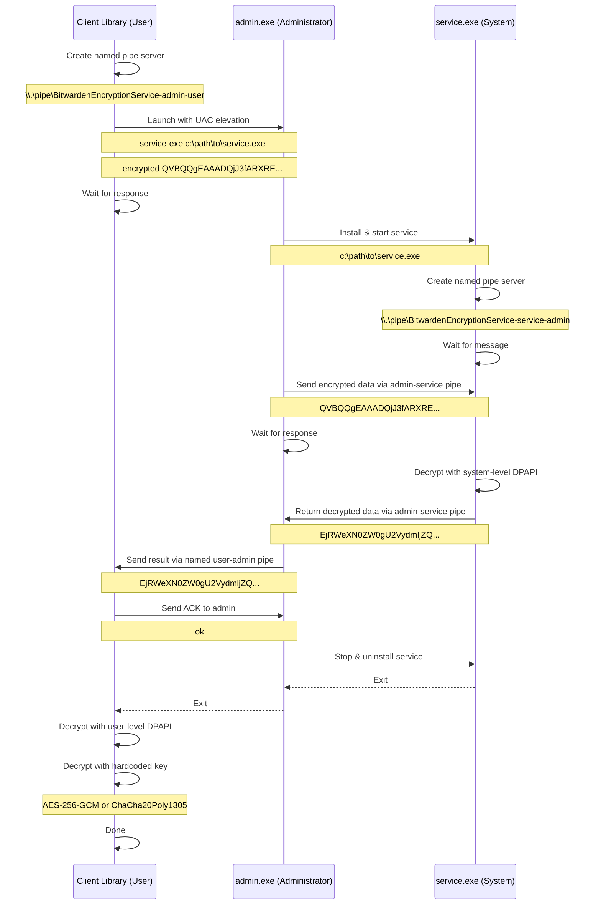

# Chromium Direct Importer

A rust library that allows you to directly import credentials from Chromium-based browsers.

## Windows ABE Architecture

On Windows chrome has additional protection measurements which needs to be circumvented in order to
get access to the passwords.

### Overview

The Windows Application Bound Encryption (ABE) consists of three main components that work together:

- **client library** -- Library that is part of the desktop client application
- **admin.exe** -- Service launcher running as ADMINISTRATOR
- **service.exe** -- Background Windows service running as SYSTEM

_(The names of the binaries will be changed for the released product.)_

### The goal

The goal of this subsystem is to decrypt the master encryption key with which the login information
is encrypted on the local system in Windows. This applies to the most recent versions of Chrome and
Edge (untested yet) that are using the ABE/v20 encryption scheme for some of the local profiles.

The general idea of this encryption scheme is that Chrome generates a unique random encryption key,
then encrypts it at the user level with a fixed key. It then sends it to the Windows Data Protection
API at the user level, and then, using an installed service, encrypts it with the Windows Data
Protection API at the system level on top of that. This triply encrypted key is later stored in the
`Local State` file.

The next paragraphs describe what is done at each level to decrypt the key.

### 1. Client library

This is a Rust module that is part of the Chromium importer. It only compiles and runs on Windows
(see `abe.rs` and `abe_config.rs`). Its main task is to launch `admin.exe` with elevated privileges
by presenting the user with the UAC screen. See the `abe::decrypt_with_admin_and_service` invocation
in `windows.rs`.

This function takes three arguments:

1. Absolute path to `admin.exe`
2. Absolute path to `service.exe`
3. Base64 string of the ABE key extracted from the browser's local state

It's not possible to install the service from the user-level executable. So first, we have to
elevate the privileges and run `admin.exe` as ADMINISTRATOR. This is done by calling `ShellExecute`
with the `runas` verb. Since it's not trivial to read the standard output from an application
launched in this way, a named pipe server is created at the user level, which waits for the response
from `admin.exe` after it has been launched.

The name of the service executable and the data to be decrypted are passed via the command line to
`admin.exe` like this:

```bat
admin.exe --service-exe "c:\temp\service.exe" --encrypted "QVBQQgEAAADQjJ3fARXREYx6AMBPwpfrAQAAA..."
```

**At this point, the user must permit the action to be performed on the UAC screen.**

### 2. Admin executable

This executable receives the full path of `service.exe` and the data to be decrypted.

First, it installs the service to run as SYSTEM and waits for it to start running. The service
creates a named pipe server that the admin-level executable communicates with (see the `service.exe`
description further down).

It sends the base64 string to the pipe server in a raw message and waits for the answer. The answer
could be a success or a failure. In case of success, it's a base64 string decrypted at the system
level. In case of failure, it's an error message prefixed with an `!`. In either case, the response
is sent to the named pipe server created by the user. The user responds with `ok` (ignored).

After that, the executable stops and uninstalls the service and then exits.

### 3. System service

The service starts and creates a named pipe server for communication between `admin.exe` and the
system service. Please note that it is not possible to communicate between the user and the system
service directly via a named pipe. Thus, this three-layered approach is necessary.

Once the service is started, it waits for the incoming message via the named pipe. The expected
message is a base64 string to be decrypted. The data is decrypted via the Windows Data Protection
API `CryptUnprotectData` and sent back in response to this incoming message in base64 encoding. In
case of an error, the error message is sent back prefixed with an `!`.

The service keeps running and servicing more requests if there are any, until it's stopped and
removed from the system. Even though we send only one request, the service is designed to handle as
many clients with as many messages as needed and could be installed on the system permanently if
necessary.

### 4. Back to client library

The decrypted base64-encoded string comes back from the admin executable to the named pipe server at
the user level. At this point, it has been decrypted only once at the system level.

In the next step, the string is decrypted at the user level with the same Windows Data Protection
API.

And as the third step, it's decrypted with a hard-coded key found in the `elevation_service.exe`
from the Chrome installation. Based on the version of the encrypted string (encoded in the string
itself), it's either AES-256-GCM or ChaCha20Poly1305 encryption scheme. The details can be found in
`windows.rs`.

After all of these steps, we have the master key which can be used to decrypt the password
information stored in the local database.

### Summary

The Windows ABE decryption process involves a three-tier architecture with named pipe communication:


