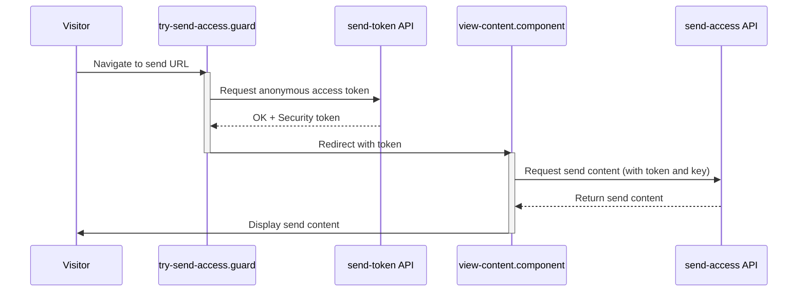
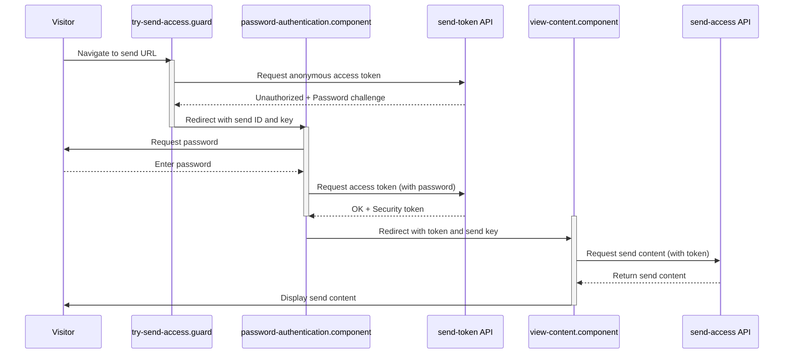
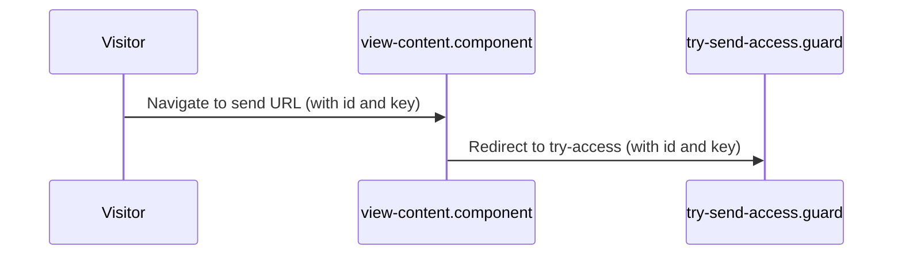

# Send Authentication Flows

In the below diagrams, activations represent client control flow.

## Public Sends

Anyone can access a public send. The token endpoint automatically issues a token. It never issues a challenge.

## Password Protected Sends

Password protected sends redirect to a password challenge prompt.

## Send Access without token

Visiting the view page without a token redirects to a try-access flow, above.

