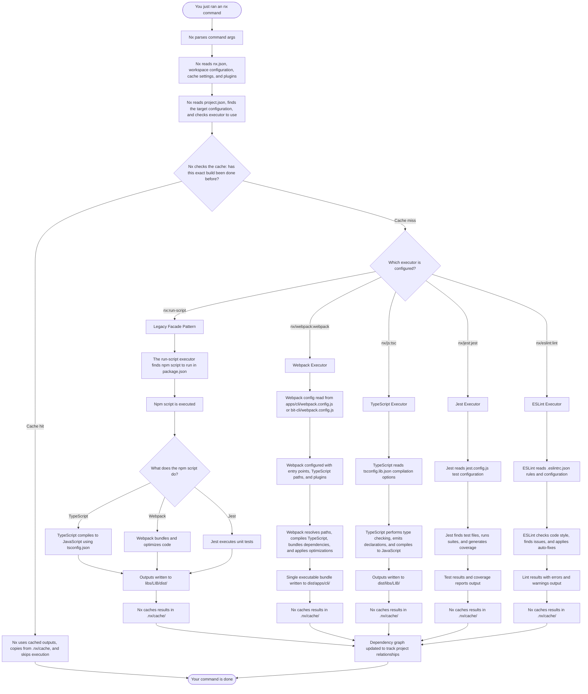

# Using Nx to Build Projects

Bitwarden uses [Nx](https://nx.dev/) to make building projects from the monorepo easier. To build, lint, or test a project you'll want to reference the project's `project.json` file for availible commands and their names. Then you'll run `npx nx [your_command] [your_project] [your_options]`. Run `npx nx --help` to see availible options, there are many.

Please note: the Nx implementation is a work in progress. Not all apps support Nx yet, CI still uses the old npm builds, and we have many "legacy" libraries that use hacks to get them into the Nx project graph.

## Quick Start

### Basic Commands

```bash
# Build a project
npx nx build cli
npx nx build state # Modern libs and apps have simple, all lowercase target names
npx nx build @bitwarden/common # Legacy libs have a special naming convention and include the @bitwarden prefix

# Test a project
npx nx test cli

# Lint a project
npx nx lint cli

# Serve/watch a project (for projects with serve targets)
npx nx serve cli

# Build all projects that differ from origin/main
nx affected --target=build --base=origin/main

# Build, lint, and test every project at once
npx nx run-many --target=build,test,lint --all

# Most projects default to the "oss-dev" build, so if you need the bitwarden license build add a --configuration
npx nx build cli --configuration=commercial-dev

# If you need a production build drop the "dev" suffix
npx nx build cli --configuration=oss # or "commercial"

# Configurations can also be passed to run-many
# For example: to run all Bitwarden licensed builds
npx nx run-many --target=build,test,lint --all --configuration=commercial

# Outputs are distrubuted in a root level /dist/ folder

# Run a locally built CLI
node dist/apps/cli/oss-dev/bw.js
```

### Global Commands

```bash
# See all projects
npx nx show projects

# Run affected projects only (great for local dev and CI)
npx nx affected:build
npx nx affected:test
npx nx affected:lint

# Show dependency graph
npx nx dep-graph
```

## Library Projects

Our libraries use two different Nx integration patterns depending on their migration status.

### Legacy Libraries

Most existing libraries use a facade pattern where `project.json` delegates to existing npm scripts. This approach maintains backward compatibility with the build methods we used before introducing Nx. These libraries are considered tech debt and Platform has a focus on updating them. For an example reference `libs/common/project.json`.

These libraries use `nx:run-script` executor to call existing npm scripts:

```json
{
  "targets": {
    "build": {
      "executor": "nx:run-script",
      "options": {
        "script": "build"
      }
    }
  }
}
```

#### Available Commands for Legacy Libraries

All legacy libraries support these standardized commands:

- **`nx build <library>`** - Build the library
- **`nx build:watch <library>`** - Build and watch for changes
- **`nx clean <library>`** - Clean build artifacts
- **`nx test <library>`** - Run tests
- **`nx lint <library>`** - Run linting

### Modern Libraries

Newer libraries like `libs/state` use native Nx executors for better performance and caching.

```json
{
  "targets": {
    "build": {
      "executor": "@nx/js:tsc",
      "outputs": ["{options.outputPath}"],
      "options": {
        "outputPath": "dist/libs/state"
      }
    }
  }
}
```

## What Happens When You Run An Nx Command



## Caching and Performance

### Nx Caching

Nx automatically caches build outputs and only rebuilds what changed:

```bash
# First run builds everything
npx nx build cli

# Second run uses cache (much faster)
npx nx build cli
```

### Clearing Cache

```bash
# Clear all caches
npx nx reset
```

## Additional Resources

- [Nx Documentation](https://nx.dev/getting-started/intro)
- [Nx CLI Reference](https://nx.dev/packages/nx/documents/cli)
- [Nx Workspace Configuration](https://nx.dev/reference/project-configuration)
