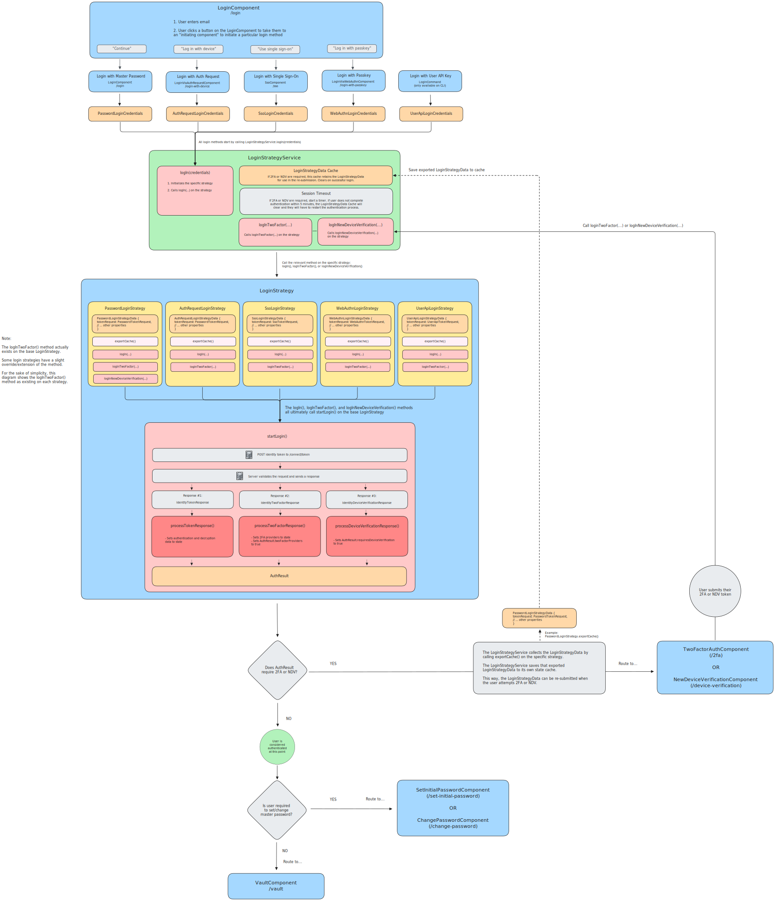

# Overview of Authentication at Bitwarden

> **Table of Contents**
>
> - [Authentication Methods](#authentication-methods)
> - [The Login Credentials Object](#the-login-credentials-object)
> - [The `LoginStrategyService` and our Login Strategies](#the-loginstrategyservice-and-our-login-strategies)
> - [The `logIn()` and `startLogIn()` Methods](#the-login-and-startlogin-methods)
> - [Handling the `AuthResult`](#handling-the-authresult)
> - [Diagram of Authentication Flows](#diagram-of-authentication-flows)

<br>

## Authentication Methods

Bitwarden provides 5 methods for logging in to Bitwarden, as defined in our [`AuthenticationType`](https://github.com/bitwarden/clients/blob/main/libs/common/src/auth/enums/authentication-type.ts) enum. They are:

1. [Login with Master Password](https://bitwarden.com/help/bitwarden-security-white-paper/#authentication-and-decryption)
2. [Login with Auth Request](https://bitwarden.com/help/log-in-with-device/) (aka Login with Device) &mdash; authenticate with a one-time access code
3. [Login with Single Sign-On](https://bitwarden.com/help/about-sso/) &mdash; authenticate with an SSO Identity Provider (IdP) through SAML or OpenID Connect (OIDC)
4. [Login with Passkey](https://bitwarden.com/help/login-with-passkeys/) (WebAuthn)
5. [Login with User API Key](https://bitwarden.com/help/personal-api-key/) &mdash; authenticate with an API key and secret

<br>

**Login Initiation**

_Angular Clients - Initiating Components_

A user begins the login process by entering their email on the `/login` screen (`LoginComponent`). From there, the user must click one of the following buttons to initiate a login method by navigating to that method's associated "initiating component":

- `"Continue"` &rarr; user stays on the `LoginComponent` and enters a Master Password
- `"Log in with device"` &rarr; navigates user to `LoginViaAuthRequestComponent`
- `"Use single sign-on"` &rarr; navigates user to `SsoComponent`
- `"Log in with passkey"` &rarr; navigates user to `LoginViaWebAuthnComponent`
  - Note: Login with Passkey is currently not available on the Desktop client.

> [!NOTE]
>
> - Our Angular clients do not support the Login with User API Key method.
>   &nbsp;
> - The Login with Master Password method is also used by the
>   `RegistrationFinishComponent` and `CompleteTrialInitiationComponent` (the user automatically
>   gets logged in with their Master Password after registration), as well as the `RecoverTwoFactorComponent`
>   (the user logs in with their Master Password along with their 2FA recovery code).

<br>

_CLI Client - `LoginCommand`_

The CLI client supports the following login methods via the `LoginCommand`:

- Login with Master Password
- Login with Single Sign-On
- Login with User API Key (which can _only_ be initiated from the CLI client)

<br>

> [!IMPORTANT]
> While each authentication method has its own unique logic, this document discusses the
> logic that is _generally_ common to all authentication methods. It provides a high-level
> overview of authentication and as such will involve some abstraction and generalization.

<br>

## The Login Credentials Object

When the user presses the "submit" action on an initiating component (or via `LoginCommand` for CLI), we build a **login credentials object**, which contains the core credentials needed to initiate the specific login method.

For example, when the user clicks "Log in with master password" on the `LoginComponent`, we build a `PasswordLoginCredentials` object, which is defined as:

```typescript
export class PasswordLoginCredentials {
  readonly type = AuthenticationType.Password;

  constructor(
    public email: string,
    public masterPassword: string,
    public twoFactor?: TokenTwoFactorRequest,
    public masterPasswordPoliciesFromOrgInvite?: MasterPasswordPolicyOptions,
  ) {}
}
```

Notice that the `type` is automatically set to `AuthenticationType.Password`, and the `PasswordLoginCredentials` object simply requires an `email` and `masterPassword` to initiate the login method.

Each authentication method builds its own type of credentials object. These are defined in [`login-credentials.ts`](https://github.com/bitwarden/clients/blob/main/libs/auth/src/common/models/domain/login-credentials.ts).

- `PasswordLoginCredentials`
- `AuthRequestLoginCredentials`
- `SsoLoginCredentials`
- `WebAuthnLoginCredentials`
- `UserApiLoginCredentials`

After building the credentials object, we then call the `logIn()` method on the `LoginStrategyService`, passing in the credentials object as an argument: `LoginStrategyService.logIn(credentials)`

<br>

## The `LoginStrategyService` and our Login Strategies

The [`LoginStrategyService`](https://github.com/bitwarden/clients/blob/main/libs/auth/src/common/services/login-strategies/login-strategy.service.ts) acts as an orchestrator that determines which of our specific **login strategies** should be initialized and used for the login process.

> [!IMPORTANT]
> Our authentication methods are handled by different [login strategies](https://github.com/bitwarden/clients/tree/main/libs/auth/src/common/login-strategies), making use of the [Strategy Design Pattern](https://refactoring.guru/design-patterns/strategy). Those strategies are:
>
> - `PasswordLoginStrategy`
> - `AuthRequestLoginStrategy`
> - `SsoLoginStrategy`
> - `WebAuthnLoginStrategy`
> - `UserApiLoginStrategy`
>
> Each of those strategies extend the base [`LoginStrategy`](https://github.com/bitwarden/clients/blob/main/libs/auth/src/common/login-strategies/login.strategy.ts), which houses common login logic.

More specifically, within its `logIn()` method, the `LoginStrategyService` uses the `type` property on the credentials object to determine which specific login strategy to initialize.

For example, the `PasswordLoginCredentials` object has `type` of `AuthenticationType.Password`. This tells the `LoginStrategyService` to initialize and use the `PasswordLoginStrategy` for the login process.

Once the `LoginStrategyService` initializes the appropriate strategy, it then calls the `logIn()` method defined on _that_ particular strategy, passing on the credentials object as an argument. For example: `PasswordLoginStrategy.logIn(credentials)`

<br>

To summarize everything so far:

```bash
Initiating Component (Submit Action)   # ex: LoginComponent.submit()
    |
    Build credentials object           # ex: PasswordLoginCredentials
    |
    Call LoginStrategyService.logIn(credentials)
        |
        Initialize specific strategy      # ex: PasswordLoginStrategy
        |
        Call strategy.logIn(credentials)  # ex: PasswordLoginStrategy.logIn(credentials)

    ...
```

<br>

## The `logIn()` and `startLogIn()` Methods

Each login strategy has its own unique implementation of the `logIn()` method, but each `logIn()` method performs the following general logic with the help of the credentials object:

1. Build a `LoginStrategyData` object with a `TokenRequest` property
2. Cache the `LoginStrategyData` object
3. Call the `startLogIn()` method on the base `LoginStrategy`

Here are those steps in more detail:

1. **Build a `LoginStrategyData` object with a `TokenRequest` property**

   Each strategy uses the credentials object to help build a type of `LoginStrategyData` object, which contains the data needed throughout the lifetime of the particular strategy, and must, at minimum, contain a `tokenRequest` property (more on this below).

   ```typescript
   export abstract class LoginStrategyData {
     tokenRequest:
       | PasswordTokenRequest
       | SsoTokenRequest
       | WebAuthnLoginTokenRequest
       | UserApiTokenRequest
       | undefined;

     abstract userEnteredEmail?: string;
   }
   ```

   Each strategy has its own class that implements the `LoginStrategyData` interface:
   - `PasswordLoginStrategyData`
   - `AuthRequestLoginStrategyData`
   - `SsoLoginStrategyData`
   - `WebAuthnLoginStrategyData`
   - `UserApiLoginStrategyData`

   So in our ongoing example that uses the "Login with Master Password" method, the call to `PasswordLoginStrategy.logIn(PasswordLoginCredentials)` would build a `PasswordLoginStrategyData` object that contains the data needed throughout the lifetime of the `PasswordLoginStrategy`.

   That `PasswordLoginStrategyData` object is defined as:

   ```typescript
   export class PasswordLoginStrategyData implements LoginStrategyData {
     tokenRequest: PasswordTokenRequest;

     userEnteredEmail: string;
     localMasterKeyHash: string;
     masterKey: MasterKey;
     forcePasswordResetReason: ForceSetPasswordReason = ForceSetPasswordReason.None;
   }
   ```

   Each of the `LoginStrategyData` types have varying properties, but one property common to all is the `tokenRequest` property.

   The `tokenRequest` property holds some type of [`TokenRequest`](https://github.com/bitwarden/clients/tree/main/libs/common/src/auth/models/request/identity-token) object based on the strategy:
   - `PasswordTokenRequest` &mdash; used by both `PasswordLoginStrategy` and `AuthRequestLoginStrategy`
   - `SsoTokenRequest`
   - `WebAuthnLoginTokenRequest`
   - `UserApiTokenRequest`

   This `TokenRequest` object is _also_ built within the `logIn()` method and gets added to the `LoginStrategyData` object as the `tokenRequest` property.

   <br />

2. **Cache the `LoginStrategyData` object**

   Because a login attempt could "fail" due to a need for Two Factor Authentication (2FA) or New Device Verification (NDV), we need to preserve the `LoginStrategyData` so that we can re-use it later when the user provides their 2FA or NDV token. This way, the user does not need to completely re-enter all of their credentials.

   The way we cache this `LoginStrategyData` is simply by saving it to a property called `cache` on the strategy. There will be more details on how this cache is used later on.

   <br />

3. **Call the `startLogIn()` method on the base `LoginStrategy`**

   Next, we call the `startLogIn()` method, which exists on the base `LoginStrategy` and is therefore common to all login strategies. The `startLogIn()` method does the following:
   1. **Makes a `POST` request to the `/connect/token` endpoint on our Identity Server**
      - `REQUEST`

        The exact payload for this request is determined by the `TokenRequest` object. More specifically, the base `TokenRequest` class contains a `toIdentityToken()` method which gets overridden/extended by the sub-classes (`PasswordTokenRequest.toIdentityToken()`, etc.). This `toIdentityToken()` method produces the exact payload that gets sent to our `/connect/token` endpoint.

        The payload includes OAuth2 parameters, such as `scope`, `client_id`, and `grant_type`, as well as any other credentials that the server needs to complete validation for the specific authentication method.

      - `RESPONSE`

        The Identity Server validates the request and then generates some type of `IdentityResponse`, which can be one of three types:
        - [`IdentityTokenResponse`](https://github.com/bitwarden/clients/blob/main/libs/common/src/auth/models/response/identity-token.response.ts)
          - Meaning: the user has been authenticated
          - Response Contains:
            - Authentication information, such as:
              - An access token (which is a JWT with claims about the user)
              - A refresh token
            - Decryption information, such as:
              - The user's master-key-encrypted user key (if the user has a master password), along with their KDF settings
              - The user's user-key-encrypted private key
              - A `userDecryptionOptions` object that contains information about which decryption options the user has available to them
              - A flag that indicates if the user is required to set or change their master password
              - Any master password policies the user is required to adhere to

        - [`IdentityTwoFactorResponse`](https://github.com/bitwarden/clients/blob/main/libs/common/src/auth/models/response/identity-two-factor.response.ts)
          - Meaning: the user needs to complete Two Factor Authentication
          - Response Contains:
            - A list of which 2FA providers the user has configured
            - Any master password policies the user is required to adhere to

        - [`IdentityDeviceVerificationResponse`](https://github.com/bitwarden/clients/blob/main/libs/common/src/auth/models/response/identity-device-verification.response.ts)
          - Meaning: the user needs to verify their new device via [new device verification](https://bitwarden.com/help/new-device-verification/)
          - Response Contains: a simple boolean property that states whether or not the device has been verified

   2. **Calls one of the `process[IdentityType]Response()` methods**

      Each of these methods builds and returns an [`AuthResult`](https://github.com/bitwarden/clients/blob/main/libs/common/src/auth/models/domain/auth-result.ts) object, which gets used later to determine how to direct the user after an authentication attempt.

      The specific method that gets called depends on the type of the `IdentityResponse`:
      - If `IdentityTokenResponse` &rarr; call `processTokenResponse()`
        - Instantiates a new `AuthResult` object
        - Calls `saveAccountInformation()` to initialize the account with information from the `IdentityTokenResponse`
          - Decodes the access token (a JWT) to get information about the user (userId, email, etc.)
          - Sets several things to state:
            - The account (via `AccountService`)
            - The user's environment
            - `userDecryptionOptions`
            - `masterPasswordUnlockData` (_if_ `userDecryptionOptions` allows for master password unlock):
              - Salt
              - KDF config
              - Master-key-encrypted user key
            - Access token and refresh token
            - KDF config
            - Premium status
        - If the `IdentityTokenResponse` contains a `twoFactorToken` (because the user previously selected "remember me" for their 2FA method), set that token to state
        - Sets cryptographic properties to state: master key, user key, private key
        - Sets a `forceSetPasswordReason` to state (if necessary)
        - Returns the `AuthResult`

      - If `IdentityTwoFactorResponse` &rarr; call `processTwoFactorResponse()`
        - Instantiates a new `AuthResult` object
        - Sets `AuthResult.twoFactorProviders` to the list of 2FA providers from the `IdentityTwoFactorResponse`
        - Sets that same list of of 2FA providers to global state (memory)
        - Returns the `AuthResult`

      - If `IdentityDeviceVerificationResponse` &rarr; call `processDeviceVerificationResponse()`
        - Instantiates a new `AuthResult` object
        - Sets `AuthResult.requiresDeviceVerification` to `true`
        - Returns the `AuthResult`

<br>

## Handling the `AuthResult`

The `AuthResult` object that gets returned from the `process[IdentityType]Response()` method ultimately gets returned up through the chain of callers until it makes its way back to the initiating component (ex: the `LoginComponent` for Login with Master Password).

The initiating component will then use the information on that `AuthResult` to determine how to direct the user after an authentication attempt.

Below is a high-level overview of how the `AuthResult` is handled, but note again that there are abstractions in this diagram &mdash; it doesn't depict every edge case, and is just meant to give a general picture.

```bash
Initiating Component (Submit Action) < - - -
    |                                        \
    LoginStrategyService.logIn()            - \
        |                                      \    # AuthResult bubbles back up
        strategy.logIn()                      - \   # through chain of callers
            |                                    \  # to the initiating component
            startLogIn()                        - \
                |                                  \
                process[IdentityType]Response()   - \
                    |                                \
                    returns AuthResult - - - - - - - -

    |
     - - - - - - - - - -                            # Initiating component then
                        |                           # uses the AuthResult in
    handleAuthResult(authResult)                    # handleAuthResult()
        |
        IF AuthResult.requiresTwoFactor
        |  # route user to /2fa to complete 2FA
        |
        IF AuthResult.requiresDeviceVerification
        |  # route user to /device-verification to complete NDV
        |
        # Otherwise, route user to /vault
```

<br />

Now for a more detailed breakdown of how the `AuthResult` is handled...

There are two broad types of scenarios that the user will fall into:

1. Re-submit scenarios
2. Successful Authentication scenarios

### Re-submit Scenarios

There are two cases where a user is required to provide additional information before they can be authenticated: Two Factor Authentication (2FA) and New Device Verification (NDV). In these scenarios, we actually need the user to "re-submit" their original request, along with their added 2FA or NDV token. But remember earlier that we cached the `LoginStrategyData`. This makes it so the user does not need to re-enter their original credentials. Instead, the user simply provides their 2FA or NDV token, we add it to their original (cached) `LoginStrategyData`, and then we re-submit the request.

Here is how these scenarios work:

**User must complete Two Factor Authentication**

1. Remember that when the server response is `IdentityTwoFactorResponse`, we set 2FA provider data into state, and also set `requiresTwoFactor` to `true` on the `AuthResult`.
2. When `AuthResult.requiresTwoFactor` is `true`, the specific login strategy exports its `LoginStrategyData` to the `LoginStrategyService`, where it gets stored in memory. This means the `LoginStrategyService` has a cache of the original request the user sent.
3. We route the user to `/2fa` (`TwoFactorAuthComponent`).
4. The user enters their 2FA token.
5. On submission, the `LoginStrategyService` calls `logInTwoFactor()` on the particular login strategy. This method then:
   - Takes the cached `LoginStrategyData` (the user's original request), and appends the 2FA token onto the `TokenRequest`
   - Calls `startLogIn()` again, this time using the updated `LoginStrategyData` that includes the 2FA token.

**User must complete New Device Verification**

Note that we currently only require new device verification on Master Password logins (`PasswordLoginStrategy`) for users who do not have a 2FA method setup.

1. Remember that when the server response is `IdentityDeviceVerificationResponse`, we set `requiresDeviceVerification` to `true` on the `AuthResult`.
2. When `AuthResult.requiresDeviceVerification` is `true`, the specific login strategy exports its `LoginStrategyData` to the `LoginStrategyService`, where it gets stored in memory. This means the `LoginStrategyService` has a cache of the original request the user sent.
3. We route the user to `/device-verification`.
4. The user enters their NDV token.
5. On submission, the `LoginStrategyService` calls `logInNewDeviceVerification()` on the particular login strategy. This method then:
   - Takes the cached `LoginStrategyData` (the user's original request), and appends the NDV token onto the `TokenRequest`.
   - Calls `startLogIn()` again, this time using the updated `LoginStrategyData` that includes the NDV token.

### Successful Authentication Scenarios

**User must change their password**

A user can be successfully authenticated but still required to set/change their master password. In this case, the user gets routed to the relevant set/change password component (`SetInitialPassword` or `ChangePassword`).

**User does not need to complete 2FA, NDV, or set/change their master password**

In this case, the user proceeds to their `/vault`.

**Trusted Device Encryption scenario**

If the user is on an untrusted device, they get routed to `/login-initiated` to select a decryption option. If the user is on a trusted device, they get routed to `/vault` because decryption can be done automatically.

<br>

## Diagram of Authentication Flows

Here is a high-level overview of what all of this looks like in the end.

<br>


