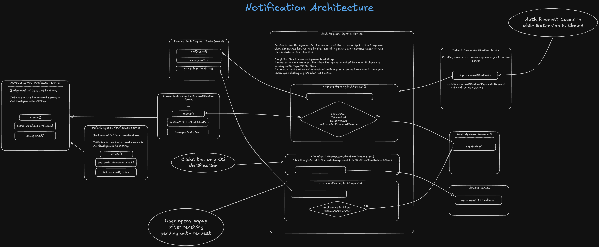

# Auth Request Answering Service

This feature is to allow for the taking of auth requests that are received via websockets by the background service to
be acted on when the user loads up a client. Currently only implemented with the browser client.

See diagram for the high level picture of how this is wired up.

## Diagram

